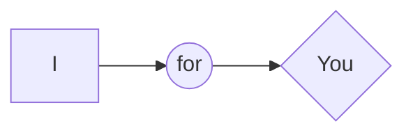

# MEMORY GAME

This is a project made for the course _**Udacity** - Front-End Web Developer Nanodegree Program_
Author - **Bogdan Pasterak**

## Table of Contents

* [Contributing](#contributing)
* [Instructions](#instructions)
* [Licence](#licence)

## Contributing

This repository can be used by anyone for any positive purpose.
It was created for learning and has fun to play.

## Instructions

You can clone the repository:
`git clone https://github.com/BogdanPasterak/memory-game.git`

Or watch the effect on [GitHub Pages](https://bogdanpasterak.github.io/memory-game/)

## Licence
  
No rights are reserved

