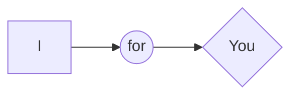

# MEMORY GAME

This is a project made for the course _**Udacity** - Front-End Web Developer Nanodegree Program_
Author - **Bogdan Pasterak**

## Table of Contents

* [Contributing](#contributing)
* [Instructions](#instructions)
* [Combinations](#combinations)
* [Licence](#licence)

## Contributing

This repository can be used by anyone for any positive purpose.
It was created for learning and has fun to play.

## Instructions

You can clone the repository:
`git clone https://github.com/BogdanPasterak/memory-game.git`

Or watch the effect on [GitHub Pages](https://bogdanpasterak.github.io/memory-game/)

## Combinations

In mathematics, a combination is a selection of items from a collection, such that (unlike permutations) the order of selection does not matter. We use binomial coefficient to calculate the combination. **Binomial coefficient**. Commonly, a binomial coefficient is indexed by a pair of integers _n_  ≥  _k_  ≥ 0 and is written

For example, from the set of 9 cards, we choose triples. We turn first and we have to hit 2 from the set of the other 8. If it works, we turn the next one. and again we are looking for 2 of the other 5. How good it was, it's the other 3. Must match.

### Below is a table with calculations for my game.
| stakes | 2 of a kind | 3 of a kind | 4 of a kind |
|---|---|---|---|
|4|3|-|-|
|6|15|10|-|
|8|105|-|35|
|9|-|280|-|
|10|945|-|-|
|12|10,395|15,400|5,775|
|14|135,135|-|-|
|15|-|1,201,200|-
|16|2,027,025|-|2,627,625|
|18|3.44 x 107|1.63 x 108|-|
|20|6.54 x 108|-|2.54 x 109|
|21|-|3.10 x 1010|-|
|22|1.37 x 1010|-|-|
|24|3.16 x 1011|7.85 x 1012|4.50 x 1012|

### I wish you a lot of luck

## Licence
  
No rights are reserved

